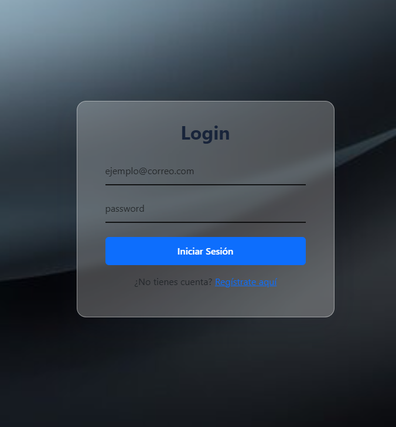
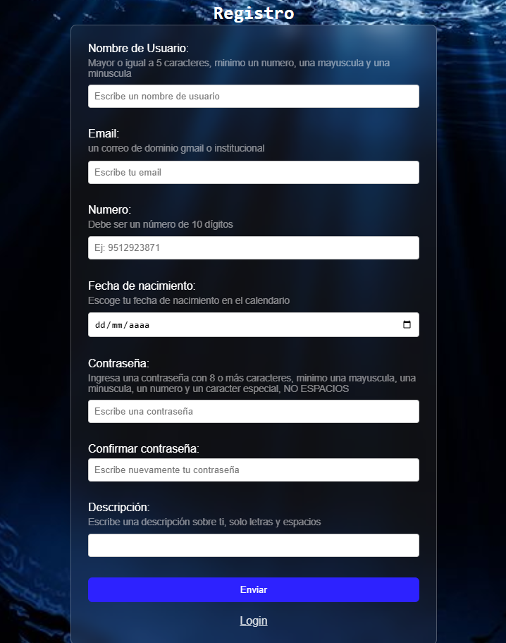
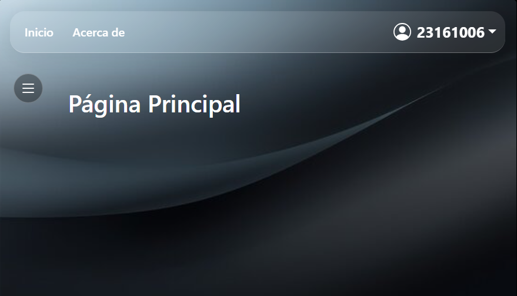

# SISTEMAS DE REGISTRO DE USUARIOS

## Portada

### Proyecto Login

**Integrantes del Equipo**

- Enriquez Valencia Oliver Gildardo 23160889
- Martinez Cruz Gael 23161006 

# Descripcion breve
Este proyecto de login consiste en dos pantallas donde se realiza toda la logica, pantalla de login, en donde se ingresara al sistema y se busca en el local storage que si existan las credenciales del usuario para ingresar, la pantalla del index, en donde se muestra el navbar y el sidebar

# Explicacion

Se uso bootstrap css como framework de diseño css para el diseño (glass) de los componentes navbar y sidebar, asi como para el form del login

# Funcionalidad del sistema
## Flujo del Sistema
### Login
La primera vez si no existe un usuario registrado dentro del sistema, se redirigira a la pantalla del login, en donde, podra registrarse en caso de que no haya ninguna cuenta


Al presionar *Registrarse aqui* se cargara el registro de usuarios, en donde se podra crear un cuenta


esta pantalla realiza validaciones en cada uno de sus campos

Cuando se ingresa con el usuario creado, y sera redirigido al index.html, en esta pantalla se muestra en navbar y el sidebar, el navbar contiene el nombre de usuario (numero de control de la persona)


este dato se obtiene del local storage del navegador, cuando se hace el registro del usuario se almacena ahi de esta manera


[Codigo de almacenamiento en el localStorage](js/registro.js)
```javascript
if (todoValido == false) {
                evento.preventDefault();
            } else {
                evento.preventDefault(); 

                const nuevoUsuario = {
                    username: inputUser.value.trim(),
                    email: inputemail.value.trim(),
                    numero: inputNum.value.trim(),
                    fechaNacimiento: inputFecha.value,
                    password: inputContra.value,
                    descripcion: inputdesc.value.trim()
                };

                let usuariosRegistrados = JSON.parse(localStorage.getItem("usuarios")) || [];

                const correoExiste = usuariosRegistrados.find(
                    (user) => user.email === nuevoUsuario.email
                );

                if (correoExiste) {
                    mensajeError1.style.color = "red";
                    mensajeError1.textContent = "Este correo electrónico ya está registrado.";
                    return; 
                }

                usuariosRegistrados.push(nuevoUsuario);
                localStorage.setItem("usuarios", JSON.stringify(usuariosRegistrados));

                localStorage.setItem("usuarioActivo", nuevoUsuario.username);

                alert("¡Registro exitoso! Bienvenido " + nuevoUsuario.username);
            }
```
para poder traer el nombre del usuario al navbar

[Codigo de del navbar.js que guarda el nombre del usuario](js/navbar.js)

```
const nombreUsuario = document.getElementById("nombre-usuario");
```

[Codigo de navbar.html que muestra el nombre del usuario en el navbar](navbar.html)

```
<span class="ms-2 fw-bold text-white" id="nombre-usuario">Sistema</span>
```